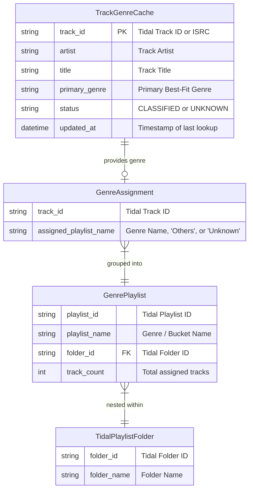
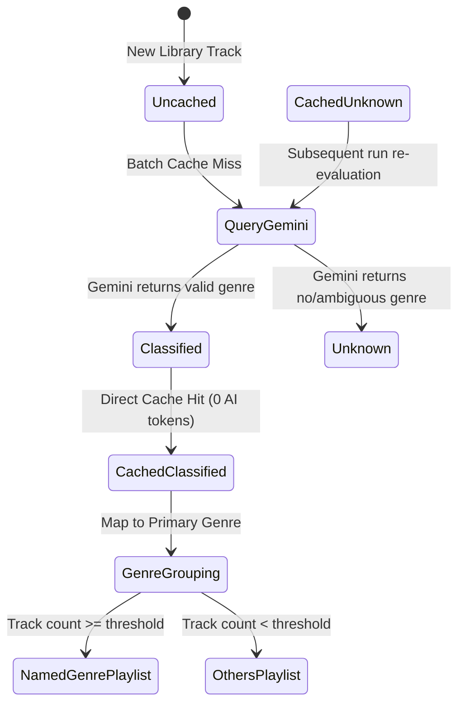

# Data Model: Genre Playlist Database Caching & Optimization

## Entities & Schemas

### Table Schema: `track_genre_cache` (SQLite)

| Column | Type | Constraints | Description |
|---|---|---|---|
| `track_id` | TEXT | PRIMARY KEY | Unique identifier for track (Tidal Track ID or ISRC) |
| `artist` | TEXT | NOT NULL | Artist name |
| `title` | TEXT | NOT NULL | Track title |
| `primary_genre` | TEXT | NOT NULL | Best-fit primary genre name |
| `status` | TEXT | NOT NULL | Classification state: `'CLASSIFIED'` or `'UNKNOWN'` |
| `updated_at` | TIMESTAMP | DEFAULT CURRENT_TIMESTAMP | Last cache insert/update timestamp |

### State Transitions

