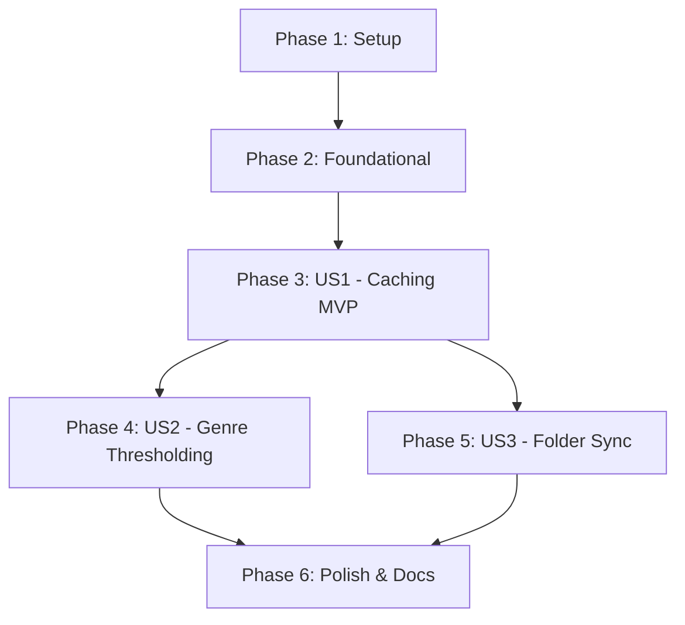

# Tasks: Genre Playlist Database Caching & Optimization

**Input**: Design documents from `/specs/014-cache-genre-playlists/`

**Prerequisites**: plan.md (required), spec.md (required for user stories), research.md, data-model.md, contracts/

## Format: `[ID] [P?] [Story] Description`

- **[P]**: Can run in parallel (different files, no dependencies)
- **[Story]**: Which user story this task belongs to ([US1], [US2], [US3])
- Includes exact file paths in descriptions

---

## Phase 1: Setup (Shared Infrastructure)

**Purpose**: Database directory setup and SQLite connection framework

- [X] T001 Create SQLite database helper module and connection management in `src/lib/db.py`
- [X] T002 [P] Configure default database file path `data/genre_cache.db` in `.env` / configuration

---

## Phase 2: Foundational (Blocking Prerequisites)

**Purpose**: SQLite schema creation and core `GenreCacheService` implementation

- [X] T003 Implement `track_genre_cache` table creation schema and migrations in `src/lib/db.py`
- [X] T004 Implement `GenreCacheService` class for SQLite cache operations in `src/services/genre_cache_service.py`
- [X] T005 [P] Create unit tests for SQLite database setup and `GenreCacheService` in `tests/test_genre_cache_service.py`

**Checkpoint**: Core SQLite cache foundation ready — user story implementation can begin

---

## Phase 3: User Story 1 - Cost-Efficient Genre Assignment via Database Caching (Priority: P1) 🎯 MVP

**Goal**: Check SQLite cache before calling Gemini, query Gemini only for uncached/unknown tracks, and persist results.

- [X] T006 [US1] Implement batch track lookup (`get_cached_genres`) in `src/services/genre_cache_service.py`
- [X] T007 [US1] Implement batch cache insertion/upsert (`save_track_genres`) in `src/services/genre_cache_service.py`
- [X] T008 [US1] Integrate `GenreCacheService` into `src/services/genre_playlist_service.py` to filter uncached tracks before Gemini API calls
- [X] T009 [US1] Implement logic in `src/services/genre_playlist_service.py` to re-query Gemini for previously cached "Unknown" tracks
- [X] T010 [P] [US1] Add unit tests for cache hits, cache misses, and "Unknown" re-evaluation in `tests/test_genre_cache_service.py`

---

## Phase 4: User Story 2 - Obscure Genre Thresholding & Best-Fit Grouping (Priority: P2)

**Goal**: Support `--min-genre-size` thresholding to group sparse genres into an "Others" playlist.

- [X] T011 [US2] Update CLI command options in `src/cli/main.py` to accept `--min-genre-size` (default 5) and `--db-path`
- [X] T012 [US2] Implement genre grouping and thresholding logic in `src/services/genre_playlist_service.py` to route genres < `min_genre_size` into "Others"
- [X] T013 [US2] Ensure strict 1-to-1 best-fit track assignment to single target playlist in `src/services/genre_playlist_service.py`
- [X] T014 [P] [US2] Add unit tests for genre thresholding and "Others" bucket allocation in `tests/test_genre_playlist_service.py`

---

## Phase 5: User Story 3 - Idempotent Playlist Folder Synchronization (Priority: P3)

**Goal**: Sync Tidal genre playlists, remove empty/obsolete playlists, and update in ascending track count order.

- [X] T015 [US3] Implement Tidal folder and playlist diffing logic in `src/services/genre_playlist_service.py` to add new tracks and remove deleted tracks
- [X] T016 [US3] Implement clean playlist deletion/emptying logic in `src/services/genre_playlist_service.py` when a genre track count drops to 0
- [X] T017 [US3] Implement ascending track count sort order for playlist updates in `src/services/genre_playlist_service.py`
- [X] T018 [P] [US3] Add unit tests for playlist diffing, obsolete playlist removal, and update ordering in `tests/test_genre_playlist_service.py`

---

## Phase 6: Polish & Cross-Cutting Concerns

**Purpose**: CLI feedback, performance reporting, and end-to-end validation

- [X] T019 Implement CLI progress output and token cost savings summary report in `src/cli/main.py`
- [X] T020 [P] Add CLI integration tests in `tests/test_cli.py` covering `--min-genre-size` and `--db-path` flags
- [X] T021 Update end-user documentation and CLI usage examples in `README.md` and `specs/014-cache-genre-playlists/quickstart.md`

---

## Dependencies & Completion Order

---

## Parallel Execution Examples

- **Parallel Unit Testing**: T005, T010, T014, T018, and T020 can be developed in parallel as their corresponding service logic is completed.
- **Parallel CLI & Service Tasks**: T011 (CLI flags) can be developed in parallel with T012/T013 (Service thresholding logic).
