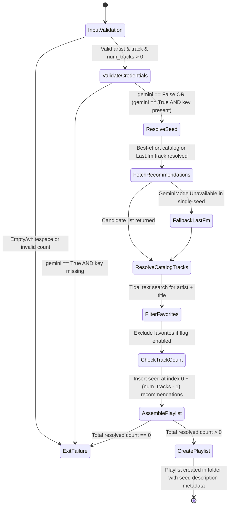

# Phase 1 Data Model: Dedicated Radio CLI Command

## Overview
This document specifies the entities, input parameters, metadata objects, and validation rules governing the dedicated `radio` command.

## Entities

### 1. SingleSeedSpecification
The validated input parameters supplied by the user defining the origin seed track and discovery preferences.

| Field | Type | Required | Default | Validation & Rules |
|---|---|---|---|---|
| `artist` | `str` | Yes | N/A | Must not be empty or pure whitespace. Normalized via `.strip()`. |
| `track` | `str` | Yes | N/A | Must not be empty or pure whitespace. Normalized via `.strip()`. |
| `num_tracks` | `int` | No | `50` | Desired total playlist track count (> 0). Sourced from `--num-tracks` or `--num-similar-tracks`. Composed of 1 seed track at Track #1 + `num_tracks - 1` recommendations. |
| `playlist_name` | `Optional[str]` | No | `None` | If `None` or omitted, defaults to `f"{artist} - {track} Radio"`. Evaluates `{date}` token to `YYYYMMDD`. |
| `gemini` | `bool` | No | `False` | When `True`, requires `GEMINI_API_KEY` in environment. |
| `shuffle` | `bool` | No | `False` | Deep-cut underground discovery when `gemini=True`; randomizes track ordering when `gemini=False`. |
| `exclude_favorites` | `bool` | No | `False` | When `True`, filters candidate tracks matching Tidal user favorites snapshot. |
| `folder` | `Optional[str]` | No | `"Radio"` | Name of Tidal destination folder. Defaults to `"Radio"`. Playlist is placed inside target folder. |

### 2. ResolvedSeedTrack
The resolved catalog or contextual representation of the user-provided seed track.

| Field | Type | Description |
|---|---|---|
| `artist_name` | `str` | Formatted artist name |
| `track_title` | `str` | Formatted track title |
| `catalog_id` | `Optional[str]` | Authoritative Tidal track ID if catalog search succeeded, otherwise `None` |
| `resolution_status` | `Literal["exact", "ambiguous", "text_only"]` | Outcome of Tidal catalog resolution |

### 3. PlaylistDestinationMetadata
The metadata container passed to Tidal API for playlist creation.

| Field | Type | Description |
|---|---|---|
| `title` | `str` | Destination playlist name with tokens substituted |
| `description` | `str` | Bounded (< 500 chars) description metadata documenting the origin seed: `f"Seed track: {track} by {artist} • Total tracks: {count}"` |
| `folder_id` | `Optional[str]` | Destination folder identifier if `--folder` was resolved, else `None` |
| `track_ids` | `list[str]` | Ordered list of resolved Tidal track IDs: seed track ID at index 0 (if catalog resolved), followed by up to `num_tracks - 1` recommendation track IDs |

### 4. RecommendationResultItem
An individual candidate recommended track retrieved from either Last.fm or Google Gemini.

| Field | Type | Description |
|---|---|---|
| `artist` | `str` | Candidate track artist name |
| `title` | `str` | Candidate track title |
| `isrc` | `Optional[str]` | Track ISRC if provided by provider (authoritative only; generative AI models strictly prohibited from producing ISRCs per Principle VIII) |
| `resolved_tidal_track` | `Optional[tidalapi.Track]` | Tidal track object found via authoritative text catalog search |

## Validation & State Transitions

