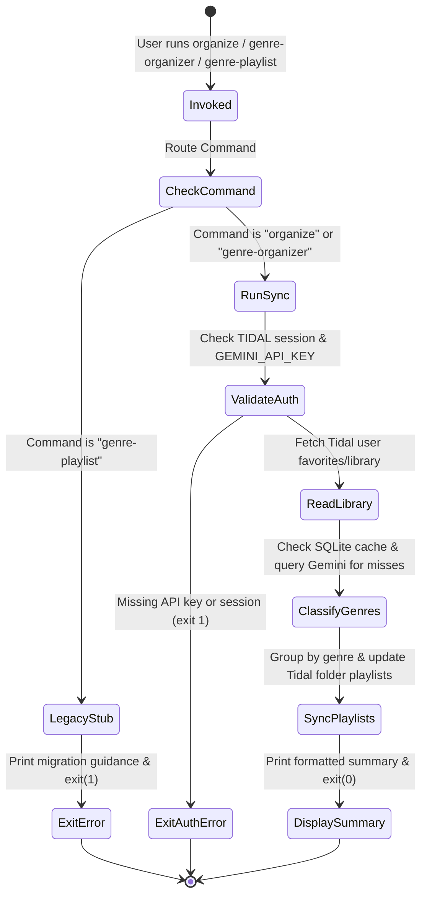

# Data Model: Genre Organizer CLI & Service

**Feature**: `specs/018-rename-genre-playlist/spec.md`  
**Branch**: `018-rename-genre-playlist`  
**Date**: 2026-09-10  

## Overview

This document formalizes the entities, parameter data types, validation rules, and summary structures used by the `organize` CLI command, its `genre-organizer` alias, and the underlying `genre_organizer_service`.

---

## Entities

### 1. Command Invocation Parameters

Represents input arguments passed to the CLI via options or defaults.

| Parameter | Type | Default | Constraints & Validation | Description |
|---|---|---|---|---|
| `folder` | `str` | `"Genres"` | Must be non-empty string when provided | Name of the Tidal playlist folder where genre playlists are organized. |
| `min_genre_size` | `int` | `10` | Must be an integer >= 1 | Minimum number of tracks required to form an individual genre playlist. Genres below this threshold are grouped into an "Others" playlist. |
| `db_path` | `str` / `Path` | `"data/genre_cache.db"` | Must be a valid filesystem path | Path to the SQLite persistent database cache file. Parent directory is created automatically if absent. |

---

### 2. GenreSyncSummary

The structured result returned by `run_genre_organizer_sync` and printed to stdout.

| Field | Type | Description |
|---|---|---|
| `library_tracks_scanned` | `int` | Total number of favorite/library tracks retrieved from Tidal. |
| `cache_hits` | `int` | Number of tracks resolved directly from the local SQLite cache without API calls. |
| `cache_misses` | `int` | Number of tracks queried against Gemini for genre classification. |
| `classified_tracks` | `int` | Number of tracks successfully assigned a valid genre. |
| `unknown_tracks` | `int` | Number of tracks whose genre could not be determined. |
| `playlists_created` | `int` | Number of new Tidal genre playlists created during this sync run. |
| `playlists_updated` | `int` | Number of existing Tidal genre playlists modified with added or removed tracks. |
| `playlists_deleted` | `int` | Number of empty or obsolete genre playlists removed from Tidal. |
| `duplicate_playlists_deleted` | `int` | Number of duplicate genre playlists cleaned up during synchronization. |
| `tracks_added` | `int` | Cumulative count of track entries added across all synchronized playlists. |
| `tracks_removed` | `int` | Cumulative count of track entries removed across all synchronized playlists. |

---

### 3. Persistent Cache Schema (`data/genre_cache.db`)

Retained with 100% backward compatibility to prevent unnecessary cache invalidation.

```sql
CREATE TABLE IF NOT EXISTS track_genres (
    track_id TEXT PRIMARY KEY,
    artist TEXT NOT NULL,
    title TEXT NOT NULL,
    genre TEXT NOT NULL,
    cached_at TIMESTAMP DEFAULT CURRENT_TIMESTAMP
);
```

---

## State Transitions & Execution Lifecycle


