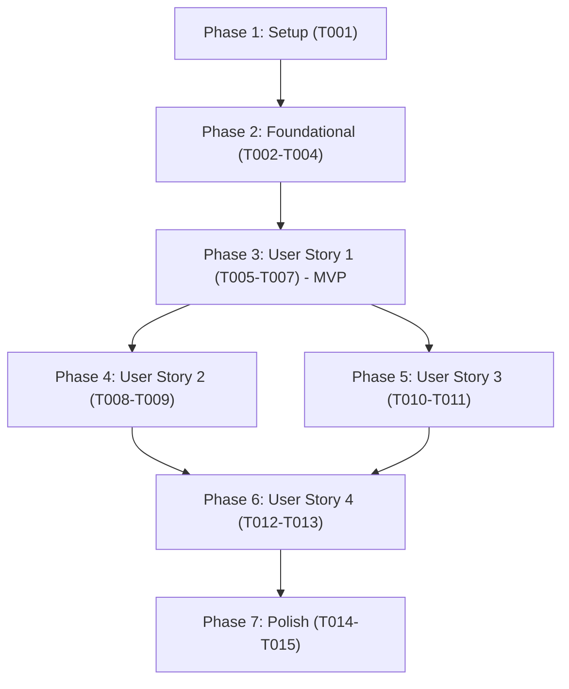

# Tasks: Rename Genre Playlist Command to Genre Organizer

**Feature**: `specs/018-rename-genre-playlist/spec.md`  
**Branch**: `018-rename-genre-playlist`  
**Date**: 2026-09-10  

## Phase 1: Setup (Shared Infrastructure)

**Purpose**: Environment verification and baseline test execution

- [x] T001 Verify virtual environment and execute existing baseline tests via `pytest tests/test_cli_genre_playlist.py tests/test_cli.py`

---

## Phase 2: Foundational (Blocking Prerequisites)

**Purpose**: Establish core service module renaming and import shims before updating CLI commands and test suites

**⚠️ CRITICAL**: Must be completed before User Story tasks can proceed

- [x] T002 Migrate and rename `src/services/genre_playlist_service.py` to `src/services/genre_organizer_service.py`, renaming the orchestration function to `run_genre_organizer_sync` and updating internal log messages to refer to "genre organizer"
- [x] T003 [P] Create backward-compatibility re-export shim in `src/services/genre_playlist_service.py` re-exporting `run_genre_organizer_sync` as `run_genre_playlist_sync`
- [x] T004 Update service imports in `src/cli/main.py` to import `run_genre_organizer_sync` from `src.services.genre_organizer_service`

**Checkpoint**: Foundation ready - new service module and compatibility shim are in place

---

## Phase 3: User Story 1 - Execute Genre Organization via Low-Friction Primary Command (Priority: P1) 🎯 MVP

**Goal**: Provide `organize` as the primary CLI command with `genre-organizer` as a supported alias, accepting `--folder`, `--min-genre-size`, and `--db-path` with identical defaults and execution behavior.

**Independent Test**: Execute `python -m src.cli.main organize --help` and `python -m src.cli.main genre-organizer --help`, then run CLI test cases verifying that both commands trigger `run_genre_organizer_sync` with matching arguments and output summaries.

### Tests for User Story 1

- [x] T005 [P] [US1] Create CLI integration and option tests for `organize` and alias `genre-organizer` in `tests/test_cli_genre_organizer.py`

### Implementation for User Story 1

- [x] T006 [US1] Implement shared CLI execution handler `_execute_genre_organizer` and register primary command `@cli.command("organize")` with `--folder`, `--min-genre-size`, and `--db-path` options in `src/cli/main.py`
- [x] T007 [US1] Register alias command `@cli.command("genre-organizer")` in `src/cli/main.py` delegating to `_execute_genre_organizer` with identical options and help docstring

**Checkpoint**: User Story 1 is functional and testable independently (MVP ready)

---

## Phase 4: User Story 2 - Comprehensive Internal Codebase and Test Suite Alignment (Priority: P2)

**Goal**: Align existing test suites and code references so that all CLI tests target `organize` and mock `run_genre_organizer_sync` without legacy naming drift.

**Independent Test**: Execute `pytest tests/test_cli.py tests/test_cli_genre_organizer.py` and confirm all tests pass cleanly.

### Implementation for User Story 2

- [x] T008 [US2] Update existing genre CLI tests in `tests/test_cli.py` to invoke `organize` instead of `genre-playlist` and patch `src.cli.main.run_genre_organizer_sync`
- [x] T009 [US2] Remove obsolete test file `tests/test_cli_genre_playlist.py` (superseded by `tests/test_cli_genre_organizer.py`)

**Checkpoint**: User Stories 1 and 2 are fully integrated and passing automated tests

---

## Phase 5: User Story 3 - Immediate Guidance for Legacy Invocations (Priority: P2)

**Goal**: Register a hidden `genre-playlist` command stub that intercepts invocations, outputs `Error: 'genre-playlist' was renamed to 'organize' (alias: 'genre-organizer').`, and exits with code 1.

**Independent Test**: Invoke `python -m src.cli.main genre-playlist` (with and without arguments) via CliRunner and assert exit code 1 and the exact migration message.

### Tests for User Story 3

- [x] T010 [P] [US3] Add tests for the retired `genre-playlist` command stub verifying exit code 1 and error output in `tests/test_cli_genre_organizer.py`

### Implementation for User Story 3

- [x] T011 [US3] Implement hidden `genre-playlist` command stub with permissive argument parsing and exit code 1 error handling in `src/cli/main.py`

**Checkpoint**: Retired command safely guides legacy users to `organize`

---

## Phase 6: User Story 4 - Consistent Documentation and Help Output (Priority: P3)

**Goal**: Update `README.md` and CLI `--help` menus to document `organize` and `genre-organizer` while ensuring `genre-playlist` is omitted from help listings.

**Independent Test**: Verify `python -m src.cli.main --help` lists `organize` and `genre-organizer` but omits `genre-playlist`, and verify `README.md` examples use `organize`.

### Tests for User Story 4

- [x] T012 [P] [US4] Add CLI help listing assertion test in `tests/test_cli_genre_organizer.py` verifying `genre-playlist` is omitted and `organize` / `genre-organizer` are present

### Implementation for User Story 4

- [x] T013 [P] [US4] Update `README.md` documentation, usage examples, command tables, and cron/scheduler snippets to feature `organize` and `genre-organizer`

**Checkpoint**: All user-facing documentation and help menus accurately reflect the feature

---

## Phase 7: Polish & Cross-Cutting Concerns

**Purpose**: End-to-end verification and cleanup across all user stories

- [x] T014 Execute full validation workflow defined in `specs/018-rename-genre-playlist/quickstart.md`
- [x] T015 Verify zero stale occurrences of `genre-playlist` in `src/` and active documentation using ripgrep

---

## Dependencies & Execution Order

### Phase Dependencies

- **Setup (Phase 1)**: Can start immediately.
- **Foundational (Phase 2)**: Depends on Setup; BLOCKS User Stories.
- **User Story 1 (Phase 3)**: Depends on Foundational. Delivers MVP.
- **User Story 2 (Phase 4)**: Depends on User Story 1.
- **User Story 3 (Phase 5)**: Depends on User Story 1. Can run in parallel with User Story 2.
- **User Story 4 (Phase 6)**: Depends on User Stories 1 & 3.
- **Polish (Phase 7)**: Depends on all User Stories being complete.

### User Story Dependencies

---

## Parallel Execution Opportunities

- **Phase 2**: T003 (`genre_playlist_service.py` shim) can be created in parallel with T002.
- **Phase 3**: T005 (tests in `tests/test_cli_genre_organizer.py`) can be written before/in parallel with T006 implementation.
- **Phase 5 & Phase 6**: T010, T012, and T013 can be worked in parallel as they touch different files (`tests/test_cli_genre_organizer.py` vs `README.md`).

---

## Implementation Strategy

### MVP First (User Story 1 Only)
1. Complete Phase 1: Setup (T001)
2. Complete Phase 2: Foundational (T002-T004)
3. Complete Phase 3: User Story 1 (T005-T007)
4. **Validate MVP**: Run `organize --help` and verify basic CLI execution.

### Incremental Delivery
1. Add User Story 2: Update existing `tests/test_cli.py` and delete obsolete test file.
2. Add User Story 3: Implement hidden `genre-playlist` stub with migration error guidance.
3. Add User Story 4: Update `README.md` and verify `--help` listings.
4. Run Polish phase to confirm all tests pass and no stale references remain.
