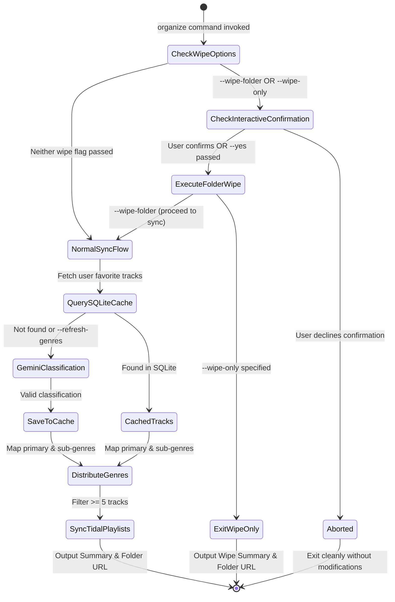

# Data Model: Multi-Genre Track Organization & Folder Wipe

**Feature**: `019-multi-genre-organizer`  
**Date**: 2026-09-10 (Revised: 2026-09-14)

---

## 1. Persistent Storage Schema: `track_genre_cache` (SQLite)

Located in `data/genre_cache.db`.

```sql
CREATE TABLE IF NOT EXISTS track_genre_cache (
    track_id TEXT PRIMARY KEY,
    artist TEXT NOT NULL,
    title TEXT NOT NULL,
    primary_genre TEXT NOT NULL,
    sub_genres TEXT, -- JSON array of strings, e.g. '["Dance-Punk", "Post-Punk Revival"]'
    status TEXT NOT NULL CHECK(status IN ('CLASSIFIED', 'UNKNOWN')),
    updated_at TIMESTAMP DEFAULT CURRENT_TIMESTAMP
);
```

### Column Descriptions & Rules
- `track_id`: Authoritative identity string. Format: `isrc:<UPPERCASE_ISRC>` if present, else fallback `fallback:<title_lower>|<artist_lower>`.
- `artist`: Artist name as provided by Tidal catalog.
- `title`: Track title as provided by Tidal catalog.
- `primary_genre`: Primary specific musical genre (e.g., "Math Rock").
- `sub_genres`: Serialized JSON list of up to 3 specific sub-genres (e.g., `["Dance-Punk", "Post-Punk Revival", "Art Punk"]`). Can be `NULL` or `'[]'` for legacy cache entries.
- `status`:
  - `'CLASSIFIED'`: Successfully categorized by AI service.
  - `'UNKNOWN'`: AI could not categorize or returned unrecognized genre; flagged for periodic re-evaluation.
- `updated_at`: UTC timestamp of last classification or refresh.

### Schema Migration
For existing databases initialized under prior specs:
```sql
-- Executed safely via helper checking PRAGMA table_info(track_genre_cache)
ALTER TABLE track_genre_cache ADD COLUMN sub_genres TEXT;
```

---

## 2. In-Memory Domain Models

### `GenreClassificationResult` (Pydantic Schema for Gemini)
```python
from pydantic import BaseModel, Field

class GenreClassificationResult(BaseModel):
    isrc: str | None = None
    title: str | None = None
    artist: str | None = None
    primary_genre: str | None = Field(
        default=None, 
        description="Exactly one primary specific genre (not broad umbrella genres like Rock or Pop)."
    )
    sub_genres: list[str] = Field(
        default_factory=list, 
        description="Up to 3 specific sub-genres. Exclude broad genres."
    )
```

### `TrackGenreProfile` (Internal Service Model)
```python
from dataclasses import dataclass, field

@dataclass
class TrackGenreProfile:
    track_id: str
    artist: str
    title: str
    primary_genre: str
    sub_genres: list[str] = field(default_factory=list)
    status: str = "CLASSIFIED"

    @property
    def all_genres(self) -> list[str]:
        """Returns deduplicated list of primary genre + all sub-genres."""
        genres = [self.primary_genre]
        for sub in self.sub_genres:
            if sub and sub.lower() != self.primary_genre.lower() and sub not in genres:
                genres.append(sub)
        return genres
```

### `GenreRunSummary` (Execution & Metrics Model)
```python
from pydantic import BaseModel
from typing import Optional

class GenreRunSummary(BaseModel):
    total_tracks_processed: int = 0
    cached_tracks: int = 0
    new_tracks_classified: int = 0
    primary_genres_count: int = 0
    sub_genres_count: int = 0
    playlists_created: int = 0
    playlists_updated: int = 0
    playlists_deleted: int = 0
    playlists_wiped: int = 0
    dry_run: bool = False
    folder_id: Optional[str] = None
    folder_url: Optional[str] = None
```

---

## 3. Entity Relationships & Execution Flow


