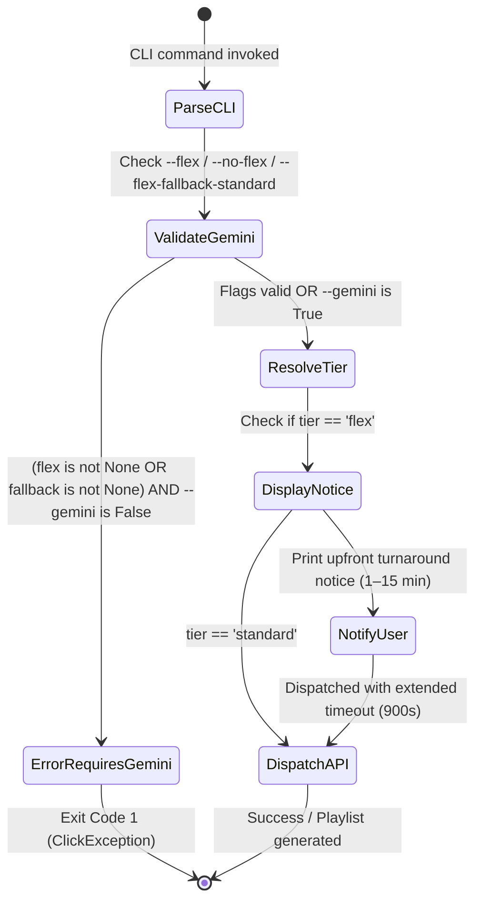
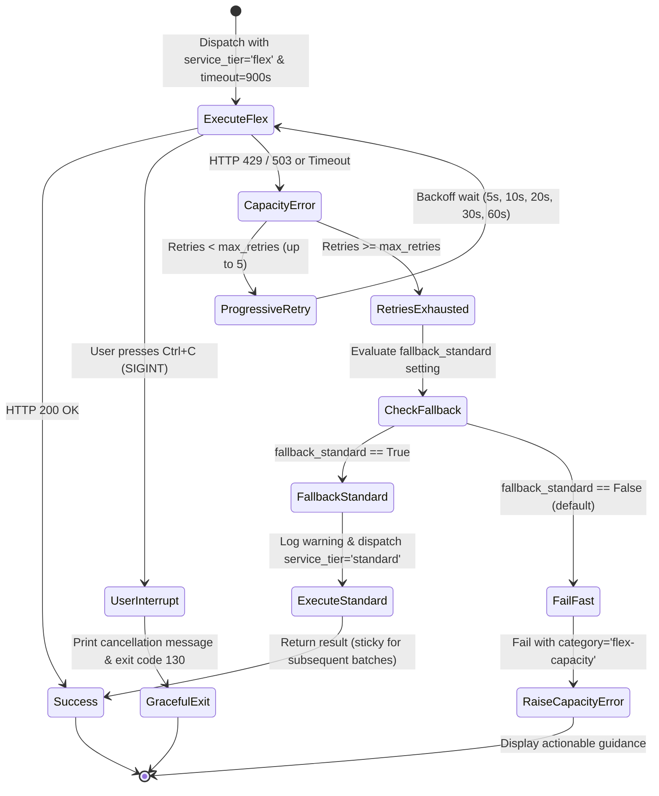

# Data Model & Entity Specifications: Gemini Flex Mode Support

**Feature**: [Gemini Flex Mode Support](spec.md)  
**Branch**: `021-gemini-flex-mode`  
**Date**: 2026-10-07  
**Status**: Completed  

---

## 1. Entities & Data Shapes

### 1.1 `ServiceTier` (Value Object / Enumeration)

Represents the operational and economic tier requested for Gemini inference.

| Value | Description | Token Pricing | Turnaround Latency | Availability Priority | Default Timeout |
|---|---|---|---|---|---|
| `standard` | Interactive inference tier | Baseline (100%) | Near-instant (1–5 seconds) | Standard capacity | 120s (120,000 ms) |
| `flex` | Latency-tolerant, cost-optimized tier | 50% discount | Variable (1–15 minutes) | Opportunistic / best-effort | 900s (900,000 ms) |

### 1.2 `ServiceTierResolution` (Value Object)

Represents the outcome of the centralized tier resolution algorithm in `gemini_service.py`.

| Field Name | Type | Allowed Values | Description |
|---|---|---|---|
| `tier` | `str` | `"standard"`, `"flex"` | The normalized service tier string to be passed to Google GenAI SDK. |
| `source` | `str` | `"cli"`, `"env"`, `"dotenv"`, `"default"` | Identifies which configuration layer determined the service tier. |
| `timeout_ms` | `int` | Integer (ms) | Client-side HTTP timeout applied to this request (e.g. 900,000 ms for flex, 120,000 ms for standard). |
| `warning` | `str \| None` | Text or `None` | Populated if an unrecognized value was provided in environment variables. |

### 1.3 `GeminiInferenceConfig` (Request Aggregate)

Represents the composite configuration applied to `client.models.generate_content`.

| Field Name | Type | Example Value | Description |
|---|---|---|---|
| `model` | `str` | `"gemini-flash-latest"` | Target Gemini model identifier. |
| `service_tier` | `str` | `"flex"` or `"standard"` | Target inference tier passed to `GenerateContentConfig`. |
| `http_options` | `HttpOptions` | `HttpOptions(timeout=900_000)` | SDK HTTP options containing extended timeout for flex mode. |
| `temperature` | `float` | `1.0` (recommendations), `0.3` (genres) | Sampling temperature. |
| `response_mime_type` | `str` | `"application/json"` | Output format requirement. |
| `response_schema` | `type` | `list[Song]`, `list[GenreClassificationResult]` | Pydantic response schema. |

### 1.4 `ActionableErrorDiagnostic` (Domain Entity)

Structured error payload generated when an inference request fails.

| Field Name | Type | Example Category | Description |
|---|---|---|---|
| `model_id` | `str` | `"gemini-flash-latest"` | Model targeted during request. |
| `category` | `str` | `"flex-capacity"`, `"flex-timeout"`, `"quota"`, `"auth"` | Machine-readable error categorization. |
| `details` | `str` | `"Request timed out after 900s"` | Underlying API error details. |
| `guidance` | `str` | `"Gemini flex tier request timed out after 900s..."` | Human-actionable guidance for immediate recovery. |

### 1.5 `ServiceTierAuditLog` (Observability Entity)

Structured informational log record emitted whenever Gemini API operations resolve their execution tier.

| Field Name | Type | Example Value | Description |
|---|---|---|---|
| `tier` | `str` | `"flex"` or `"standard"` | Active service tier resolved for inference. |
| `source` | `str` | `"cli"`, `"env"`, `"dotenv"`, `"default"` | Configuration origin of the active tier. |
| `timeout_ms` | `int` | `900000` | Configured client-side HTTP timeout in milliseconds. |

### 1.6 `FlexFallbackSetting` (Value Object)

Represents whether automatic fallback to standard tier is enabled when flex tier capacity is exhausted.

| Field Name | Type | Allowed Values | Default Value | Description |
|---|---|---|---|---|
| `fallback_standard` | `bool` | `True`, `False` | `False` | Whether to automatically fallback to standard tier inference upon flex capacity exhaustion. |
| `source` | `str` | `"cli"`, `"env"`, `"dotenv"`, `"default"` | `"default"` | Configuration origin of the fallback setting. |

---

## 2. Validation & State Transition Rules

### 2.1 CLI Argument Validation State Transition

### 2.2 Centralized Tier & Timeout Resolution Decision Matrix

| CLI Flag (`flex`) | `os.environ[GEMINI_SERVICE_TIER]` | `.env` `GEMINI_SERVICE_TIER` | `GEMINI_FLEX_TIMEOUT_SECONDS` | Resolved `tier` | Resolved `source` | Resolved `timeout_ms` |
|---|---|---|---|---|---|---|
| `True` (`--flex`) | *Any* | *Any* | *Unset* | `"flex"` | `"cli"` | `900_000` (15 min) |
| `True` (`--flex`) | *Any* | *Any* | `600` | `"flex"` | `"cli"` | `600_000` (10 min) |
| `False` (`--no-flex`) | *Any* | *Any* | *Any* | `"standard"` | `"cli"` | `120_000` (2 min) |
| `None` | `"flex"` | *Any* | *Unset* | `"flex"` | `"env"` | `900_000` (15 min) |
| `None` | `"standard"` | *Any* | *Any* | `"standard"` | `"env"` | `120_000` (2 min) |
| `None` | `"invalid"` | *Any* | *Any* | `"standard"` | `"default"` | `120_000` (with warning) |
| `None` | *Unset* | `"flex"` | *Unset* | `"flex"` | `"dotenv"` | `900_000` (15 min) |
| `None` | *Unset* | *Unset* | *Any* | `"standard"` | `"default"` | `120_000` (2 min) |

### 2.3 Flex Fallback Resolution Decision Matrix

| CLI Flag (`flex_fallback_standard`) | `os.environ[GEMINI_FLEX_FALLBACK_STANDARD]` | `.env` `GEMINI_FLEX_FALLBACK_STANDARD` | Resolved `fallback_standard` | Resolved `source` |
|---|---|---|---|---|
| `True` (`--flex-fallback-standard`) | *Any* | *Any* | `True` | `"cli"` |
| `False` (`--no-flex-fallback-standard`) | *Any* | *Any* | `False` | `"cli"` |
| `None` | `"true"`, `"1"`, `"yes"` | *Any* | `True` | `"env"` |
| `None` | `"false"`, `"0"`, `"no"` | *Any* | `False` | `"env"` |
| `None` | *Unset* | `"true"`, `"1"`, `"yes"` | `True` | `"dotenv"` |
| `None` | *Unset* | *Unset* / Invalid | `False` | `"default"` |

### 2.4 Extended Latency, Retries, and Fallback Flow

